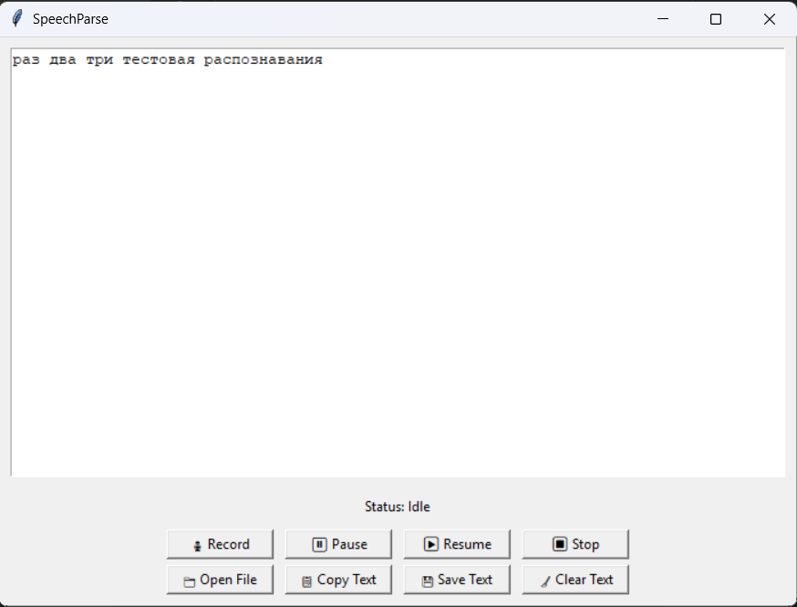

<h1>SpeechParse</h1>
It is a desktop app capable of recognising Russian speech from audio files or from mic in real time using pretrained Vosk model.<br>



If you wish to launch it, you need Git and Python 3.12. Once you have both, you can execute ```git clone```, then ```cd SpeechParse```, then ```python main.py```